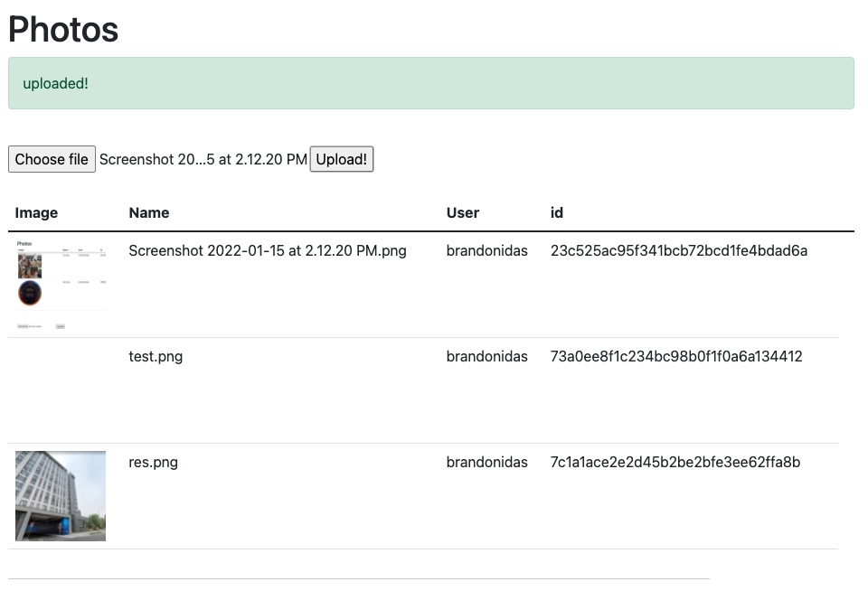

NOTE: this is repo is continually under construction, even if the recruiters don't get back to me. I think this is a good portfolio thing to have. Also, an image repository is a good platform to build many different things off of.

Dear Shopify Recruiters, given I have the sickness and an impending 3 interviews, I have left this project undone, though have applied for this round. Currently Photo uploads work. The following is the current state of the application:



STEPS:
1. DISABLE CORS : https://medium.com/swlh/avoiding-cors-errors-on-localhost-in-2020-5a656ed8cefa
2. The backend runs on flask:
    ```sh
    $ cd server
    $ python3.9 -m venv env
    $ source env/bin/activate
    (env)$ pip install -r requirements.txt
    (env)$ python app.py
    ```
3. The frontend runs on Vue:
    ```sh
    $ cd client
    $ npm install
    $ npm run serve
    ```
4. If you are a recruiting for data engineering, go to the index page, if you are recruiting of the backend team, go to directed port + "/products"

CAVEAT: I have not yet tested this on a fresh install and thus there maybe needed packages or other set up. And as every developer knows, set up is the worst part.

Citations
<br>Image uploads to flask https://pythonise.com/series/learning-flask/sending-files-with-flask
<br>The general structure of the application https://testdriven.io/blog/developing-a-single-page-app-with-flask-and-vuejs/